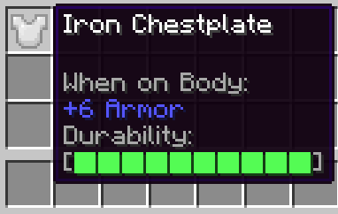

# Durability Tooltip

A simple fabric mod that show a durability bar in tooltip for items that have durability.

So, this is my first Minecraft mod, it is a clone with fewer options of [Durability Tooltip](https://modrinth.com/mod/durability-tooltip) which was developed for forge.
I may try to add more features in the future, but for now, it will only display a bar which change color depending on the durability.

| Tools                    | Weapons                   | Armor                    |
:-------------------------:|:-------------------------:|:-------------------------:
 |  | 

### FAQ
* **Client or Server?**  
  * *It is a client only mod*
* **Permission to use it in modpacks?**
  * *Sure, feel free to use it in your modpack*